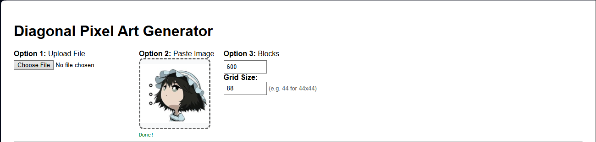
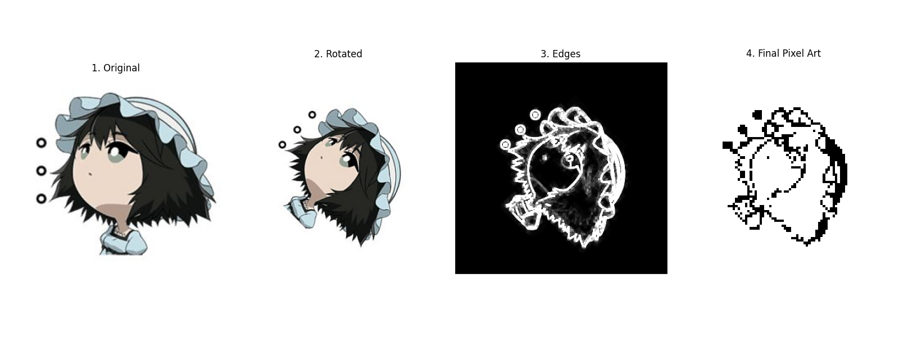

# Diagonal Pixel Art Generator




This project provides a **browser-based tool** for converting images into an optimized pixel art layout, specifically designed for creating **Clash of Clans wall art**.

The idea for this project arose from the need to create complex base designs using a strictly limited number of walls. For example, at certain Town Hall levels, the number of walls available on a **44x44 tile map** is limited to **275** (TH 10). Standard pixel art tools don't account for these limitations, often generating messy grids that exceed the available number of walls or appear distorted when viewed from the game's isometric perspective.

Powered by **PyScript**, this tool runs Python logic directly in your browser to generate a high-precision diagonal layout that uses a **exact user-defined number of blocks**. This ensures that the artwork fits perfectly within the game's constraints and utilizes every wall piece without waste.


[](LICENSE)

## Features

* **Web-Based Interface:** Run the generator directly in your browser—no Python installation required.
* **Clipboard Support:** Paste images directly from your clipboard (Ctrl+V) for instant processing.
* **Interactive Settings:** Real-time inputs to adjust the **Block Count** (Wall limit) and **Grid Size** (Map dimensions) without touching code.
* **Precise Block Count:** The output is ranked based on edge strength, guaranteeing the use of exactly **275 pixels** (or any custom limit).
* **Isometric Placement:** Automatically rotates the source image by -45° to appear upright when viewed on the diagonal game map.
* **High-Precision Edge Detection:** Performs edge detection on the high-resolution image *before* resizing, preventing "staircase jaggedness" and loss of detail.
* **Smart Downsampling:** Uses Lanczos resampling to accumulate line density, ensuring that even thin lines are represented in the final grid.

## How it Works

This tool follows a custom image processing pipeline to maximize detail in a small grid:

1.  **Preprocessing:** Handles transparency (RGBA) and automatically adjusts contrast.
2.  **Rotation:** Rotates the high-resolution image by 45° to match the game's isometric camera view.
3.  **Edge Detection:** Extracts smooth curves and lines from the full-size image.
4.  **Downsampling:** Reduces the edge map to a specific grid size (e.g., 44x44). Pixel brightness represents "line density".
5.  **Selection:** Sorts all pixels by brightness and activates only the **top N** brightest pixels (where N is your wall count).

## Getting Started

Because this project is built with PyScript, you do not need to install Python or libraries manually to use it.

### Prerequisites
* A modern web browser (Chrome, Firefox, Edge).
* An internet connection (to load PyScript and Python libraries).

### Running the Tool
1.  Clone the repository or download the files.
    ```bash
    git clone [https://github.com/Aru-gxtx/Diagonal-Pixel-Art-Generator.git](https://github.com/Aru-gxtx/Diagonal-Pixel-Art-Generator.git)
    ```
2.  Open the `index.html` file (or whichever HTML file you are using) directly in your browser.
3.  Wait a few seconds for the "System Ready" message (this indicates Python has loaded).

## Usage

The web interface provides three ways to interact with the tool:

### 1. Paste Image (Recommended)
1.  Copy any image from the web or your computer (Right Click > Copy Image).
2.  Click the dashed **"Paste Image"** box in the tool.
3.  Press `Ctrl+V`. The image will process instantly.

### 2. Upload File
1.  Click the "Choose File" button.
2.  Select an image (`.png`, `.jpg`, etc.) from your device.

### 3. Adjust Settings
You can modify the generation parameters in real-time:
* **Blocks:** The total number of walls/pixels to use (e.g., 275 for TH10).
* **Grid Size:** The size of the map square (e.g., 44 for 44x44).

*Changing these numbers will automatically re-process the last image you uploaded.*

## Development

If you wish to modify the underlying Python logic (`steps_viewable_diagonal_pixelart_gen.py`), note that the environment is managed by `pyscript.json`.

**Key Files:**
* `index.html`: The user interface and JavaScript glue code.
* `steps_viewable_diagonal_pixelart_gen.py`: The core Python processing logic.
* `pyscript.json`: Configuration for Python dependencies (Pillow, Matplotlib, Numpy).

## License

This project is licensed under the **MIT License**.

This software is free to use, modify, and distribute. See the [LICENSE](LICENSE) file for details.
