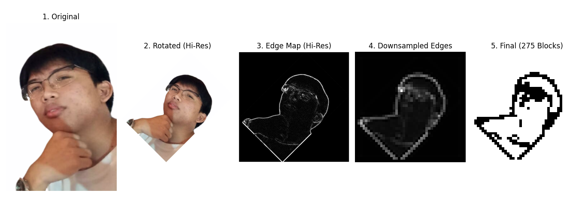

# Diagonal-Pixel-Art-Generator



This project provides a dedicated tool for converting images into an optimized pixel art layout, specifically designed for creating **Clash of Clans wall art**.

The idea for this project arose from the need to create complex base designs using a strictly limited number of walls. For example, at certain Town Hall levels, the number of walls available on a **44x44 tile map** is limited to **275**. Standard pixel art tools don't account for these limitations, often generating messy grids that exceed the available number of walls or appear distorted when viewed from the game's isometric perspective.

This Python script solves this problem by generating a high-precision diagonal layout that uses **exactly 275 blocks**. This ensures that the artwork fits perfectly within the game's constraints and utilizes every wall piece without waste.

## Features

* **Precise Block Count:** The output is ranked based on edge strength, guaranteeing the use of exactly **275 pixels** (or any custom limit).
* **Isometric Placement:** Automatically rotates the source image by -45° to appear upright when viewed on the diagonal game map.
* **High-Precision Edge Detection:** Performs edge detection on the high-resolution image *before* resizing, preventing "staircase jaggedness" and loss of detail.
* **Smart Downsampling:** Uses Lanczos resampling to accumulate line density, ensuring that even thin lines are represented in the final 44x44 grid.
* **Waste-Free Design:** Includes a boundary clearing algorithm to prevent wasted wall pieces on the grid's perimeter.
* **Visualizer:** The built-in Matplotlib viewer renders the grid in a diamond shape (isometric), allowing you to accurately preview how it will look in the game.

## How it Works

This script follows a custom image processing pipeline to maximize detail in a small grid:
1. **Preprocessing:** Handles transparency (RGBA) and automatically adjusts contrast.
2. **Rotation:** Rotates the high-resolution image by 45° to match the game's isometric camera view.
3. **Edge Detection:** Extracts smooth curves and lines from the full-size image.
4. **Downsampling:** Reduces the edge map to a 44x44 grid. Pixel brightness represents "line density".
5. **Selection:** Sorts all pixels by brightness and activates only the **top 275** brightest pixels.

## Getting Started

### Prerequisites

* Python 3.x.x
* pip

### Installation

1. Clone the repository or download the script.
  ```bash
  git clone [https://github.com/Aru-gxtx/Diagonal-Pixel-Art-Generator.git](https://github.com/Aru-gxtx/Diagonal-Pixel-Art-Generator.git)
  ```
2. Navigate to the project directory.
  ```bash
  cd Diagonal-Pixel-Art-Generator
  ```
3. Install the necessary dependencies.
  ```bash
  pip install numpy pillow matplotlib
  ```

## Usage

There are two ways to run this tool: generating the final art directly or viewing the step-by-step processing pipeline.

### 1. Standard Generation
Use this if you only need the final result.

1. Place your image in the project folder.
2. Open `diagonal_pixelart_gen.py` in a text editor.
3. Update the `input_img` variable to match your filename.
  ```python
  input_img = "gallegodz.png"
  ```
4. Run the script.
  ```bash
  python diagonal_pixelart_gen.py
  ```
5. A window displaying the final diagonal layout will appear.

### 2. Displaying Processing Steps (Debugging)
Use this if the results are not displayed correctly, or if you want to see exactly how the program is processing the image (rotation, edge detection, resizing, etc.).

1. Place the image in the project folder.
2. Open `steps_viewable_diagonal_pixelart_gen.py` in a text editor.
3. Update the `input_img` variable to match the filename.
  ```python
  input_img = "gallegodz.png"
  ```
4. Run the script.
  ```bash
  python steps_viewable_diagonal_pixelart_gen.py
  ```
5. A dashboard will appear displaying the five stages of the image processing pipeline in sequence. ## Settings

If adjustments are needed to match your town hall level or grid size, modify the parameters in the function calls within either script.

```python
# Change target_block_count to the number of available walls
canvas = generate_final_diagonal_canvas(input_img, target_block_count=300)
```

## License

This project is licensed under the **MIT License**.

This software is free to use, modify, and distribute. See the [LICENSE](LICENSE) file for details.
